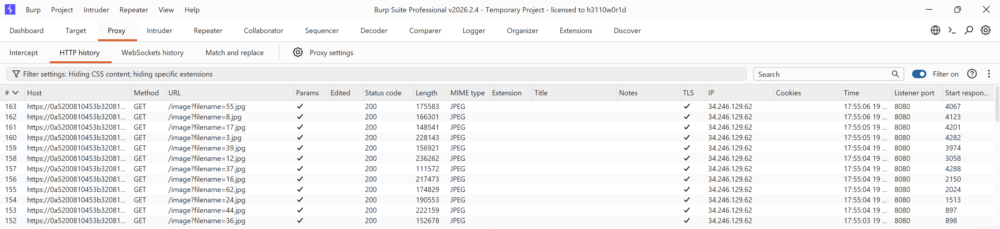
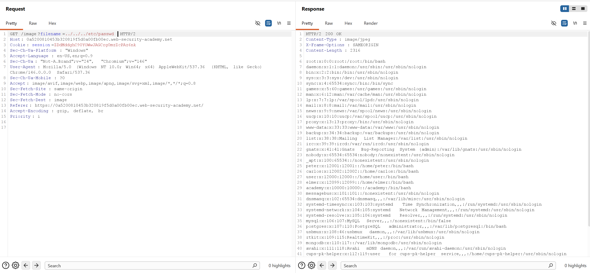
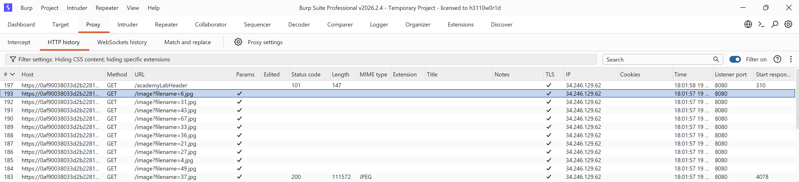
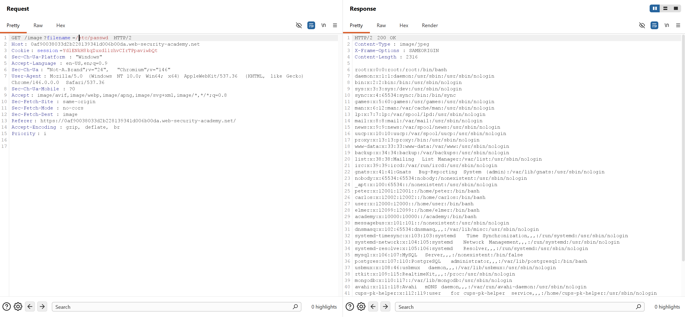
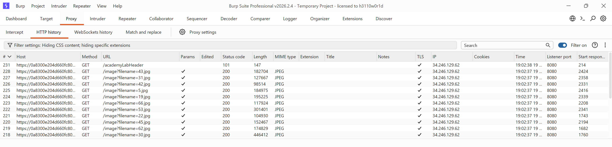
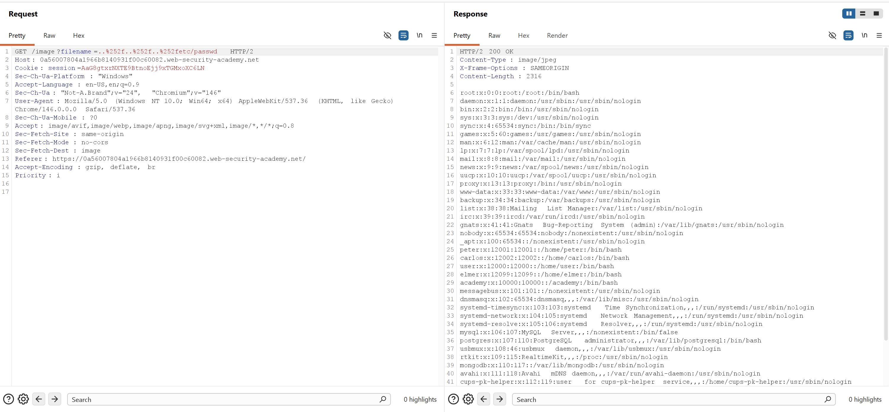
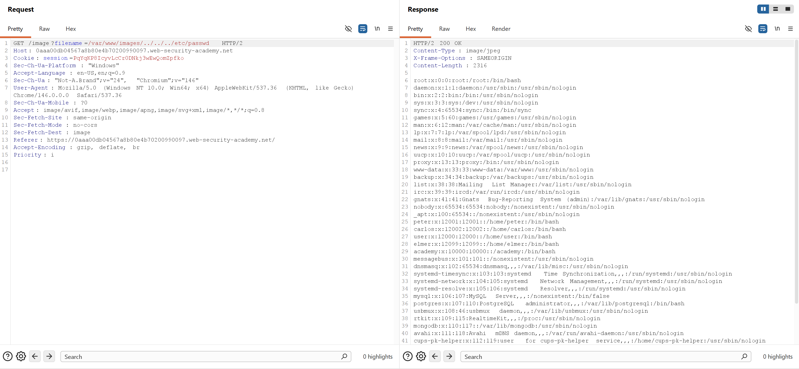
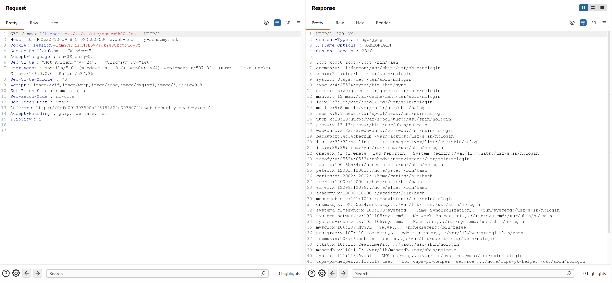

**Kiến thức về Path Traversal**

- Path Traversal là lỗ hổng cho phép attacker có thể đọc file tùy ý trên máy chủ đang chạy ứng dụng, bao gồm: 

    - Code và data application

    - Thông tin xác thực(Credentials) cho backend systems.

    - Sensitive operating system files

- Trong nhiều trường hợp, 1 attacker còn có thể viết 1 file tùy ý lên server, cho phép chỉnh sửa dữ liệu hoặc hành vi và có thể "Full Control"server đó.

---------------------------------------------------------------------------------------------------------------

```LAB: File path traversal, simple case```

- Mục tiêu: Trích xuất nội dung của /etc/passwd

- Khi truy cập vào bài lab và xem các request ta thấy 1 loạt các request đến URL /image?filename=...



- Giờ ta chỉ cần quay lại thư mục ban đầu bằng cách dùng ../../../ rồi sau đó đọc file /etc/passwd là xong 



------------------------------------------------------------------------------------------------------

```LAB: File path traversal, traversal sequences blocked with absolute path bypass```

- Mục tiêu: Trích xuất nội dung của /etc/passwd

- Ta vẫn thấy 1 loạt các request đến URL /image?filename=...



- Nhưng ở đây không cần phải quay lại thư mục cha mà ta có thể đọc luôn file /etc/passwd vì ta dùng đường dẫn tuyệt đối 



-----------------------------------------------------------------------------------------------------------

```LAB: File path traversal, traversal sequences stripped non-recursively```

- Mục tiêu: Trích xuất nội dung của /etc/passwd

- Ta vẫn thấy 1 loạt các request đến URL /image?filename=...



- Ở bài này ta sẽ dùng payload: ....//....//....// (nó cũng có nghĩa là ../../../)


--------------------------------------------------------------------------------------------------------

```Ta có thể vượt qua filter của ứng dụng bằng cách mã hõa hoặc mã hoá kép: ../ => %2e%2e%2f => %252e%252e%252f ```

-----------------------------------------------------------------------------------------------------------

```LAB: File path traversal, traversal sequences stripped with superfluous URL-decode```

- Mục tiêu: Trích xuất nội dung của /etc/passwd



-------------------------------------------------------------------------------------------------------------

- Nhiều trường hợp ứng dụng yêu cầu tệp do user cung cấp phải bắt đầu bằng thư mục gốc, vụ dụ như:

```filename=/var/www/images/../../../etc/passwd```

----------------------------------------------------------------------------------------------------------------

```LAB: File path traversal, validation of start of path```

- Mục tiêu: Trích xuất nội dung của /etc/passwd



----------------------------------------------------------------------------------------------------------------

- Một số trường hợp ứng dụng yêu cầu tệp do user cung cấp phải kết thúc bằng phần mở rộng tệp ví dụ như .png 

- Lúc này ta sẽ dùng 1 byte null để kết thúc đường dẫn tệp trước phần mở rộng bắt buộc

- Ví dụ: filename=../../../etc/passwd%00.png

------------------------------------------------------------------------------------------------------------

```LAB: File path traversal, validation of file extension with null byte bypass```

- Mục tiêu: Trích xuất nội dung của /etc/passwd



-------------------------------------------------------------------------------------------------------------

```Cách ngăn chặn```

- Xác thực dữ liệu của user trước khi xử lý 

- Sau khi xác thực hãy thêm dữ liệu đó vào thư mục gốc để chuẩn hóa 

