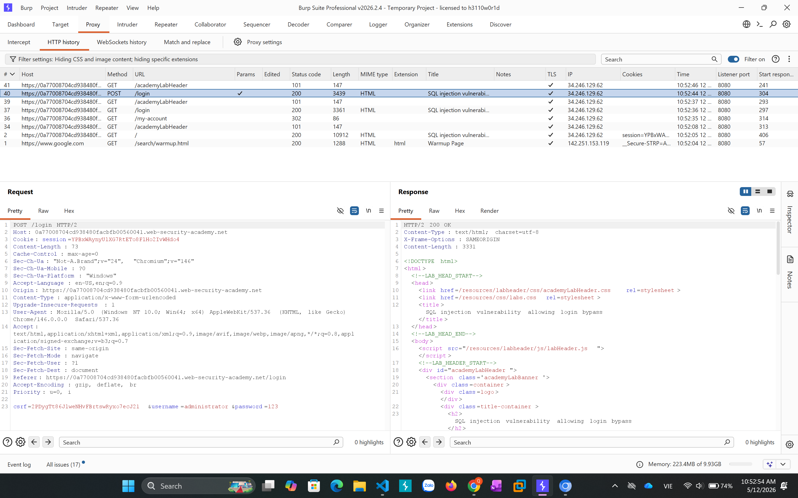
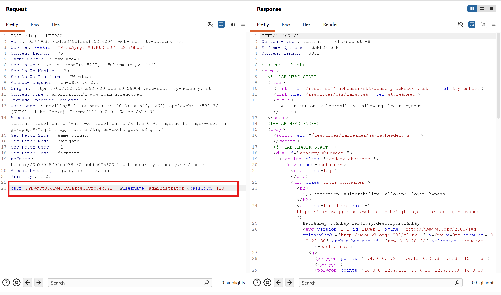
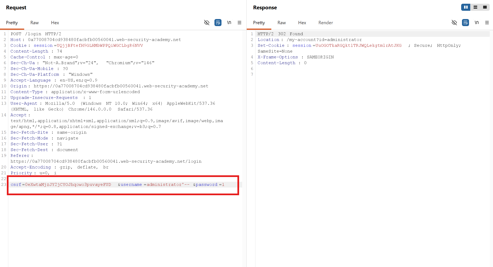
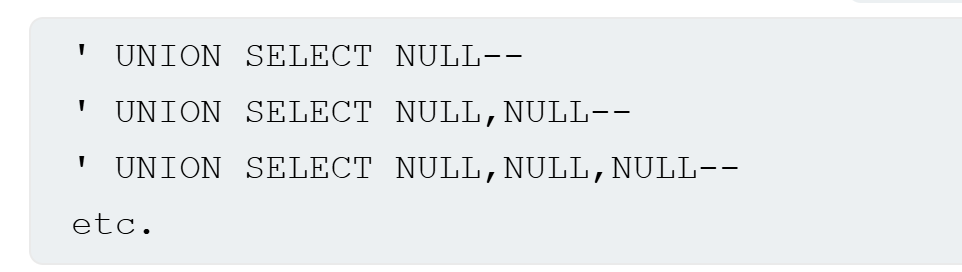

**Kiến thức về SQL Injection**

```Khái niệm```

- SQL Injection là lỗ hổng bảo mật web cho phép kẻ tấn công can thiệp vào các truy vấn mà ứng dụng thực hiện đối với CSDL của nó 

```Nguyên nhân```

- Do ứng dụng ghép trực tiếp input của user vào câu lệnh query
- Không validate dữ liệu đầu vào 

```Tác động```

- Bypass đăng nhập 
- Dump toàn bộ database (user,password)
- Sửa/xóa dữ liệu 
- RCE
- Chiếm quyền admin hệ thống 

```Điều kiện xảy ra```

- Input user được đưa vào câu truy vấn 
- Backend xử lý input không an toàn 
- Không có cơ chế escaping đúng 

LAB: SQL injection vulnerability in WHERE clause allowing retrieval of hidden data

Mục tiêu là làm xuất hiện các sản phẩm chưa phát hành 



- Ta bắt gói tin trong burp và gửi đến repeater 



Ta thử gõ cách test lỗ hổng SQLI bằng các thêm '-- vào đằng sau 



-> Ta nhận thay server trả về 200 OK 

-> Có lỗ  hổng SQLI ở đây 

Ta bypass bằng cách sau 



Bypass: ?category='+OR+1=1--

Ở đây khi user chọn 1 categories, application sẽ sử dụng 1 query như:

SELECT * FROM products WHERE category = 'Gifts' AND released = 1

Sau khi dùng dấu ' để đóng lại thì ở đằng sau là  1 mệnh đề luôn đúng thì các sản phẩm ẩn sẽ hiện ra 

-------------------------------------------------------------------------------------------

LAB: SQL injection vulnerability allowing login bypass

Mục tiêu là tấn công để đăng nhập vào tài khoản administrator

Ta đăng nhập bằng tài khoản không hợp lệ để bắt gói tin 


Sau đó gửi đến repeater


Dựa vào request ta đoán rằng khi login, application sẽ kiểm tra tài khoản bằng cách gửi query tới server theo lệnh như: 

SELECT * FROM users WHERE username = 'username' AND password = 'password'

Ta thử bypass bằng cách 


Response trả về 302 Not Found => Bypass thành công 

-------------------------------------------------------------------------------------------

```Union Attack```

Union có thể cho thêm 1 hoặc nhiều SELECT query và gán nó vào kết quả của query ban đầu 

Ví dụ: SELECT a, b FROM table1 UNION SELECT c, d FROM table2

SQL query này sẽ trả về kết quả đơn được cài đặt với 2 cột và bao gồm 4 hàng giá trị a, b của bảng 'table1' và c, d của 'table2' 

Để tiến hành 1 cuộc tấn công SQL Injection UNION Attack cần đảm bảo đạt được 2 yêu cầu 

- Biết được số cột được trả về từ query ban đầu

- Số cột được trả về từ query ban đầu là một loại data phù hợp để giữ kết quả từ việc inject query 

Cách để xác định được số lượng cột 


Nếu số lượng cột trả về không khớp thì database có thể trả về lỗi như là: 

All queries combined using a UNION, INTERSECT or EXCEPT operator must have an equal number of expressions in their target lists.
