**Kiến thức về SQL Injection**

```Khái niệm```

- SQL Injection là lỗ hổng bảo mật web cho phép kẻ tấn công can thiệp vào các truy vấn mà ứng dụng thực hiện đối với CSDL của nó 

```Nguyên nhân```

- Do ứng dụng ghép trực tiếp input của user vào câu lệnh query
- Không validate dữ liệu đầu vào 

```Tác động```

- Bypass đăng nhập 
- Dump toàn bộ database (user,password)
- Sửa/xóa dữ liệu 
- RCE
- Chiếm quyền admin hệ thống 

```Điều kiện xảy ra```

- Input user được đưa vào câu truy vấn 
- Backend xử lý input không an toàn 
- Không có cơ chế escaping đúng 

LAB: SQL injection vulnerability in WHERE clause allowing retrieval of hidden data

Mục tiêu là làm xuất hiện các sản phẩm chưa phát hành 


- Ta bắt gói tin trong burp và gửi đến repeater 


Ta thử gõ cách test lỗ hổng SQLI bằng các thêm '-- vào đằng sau 

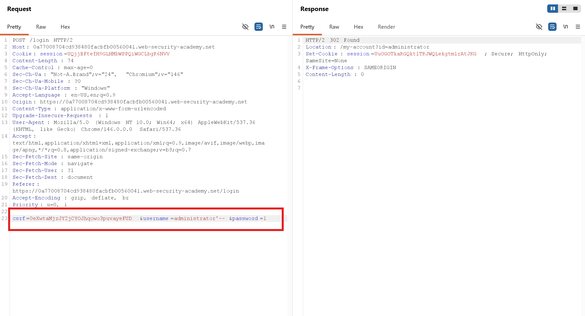

-> Ta nhận thay server trả về 200 OK 

-> Có lỗ  hổng SQLI ở đây 

Ta bypass bằng cách sau 

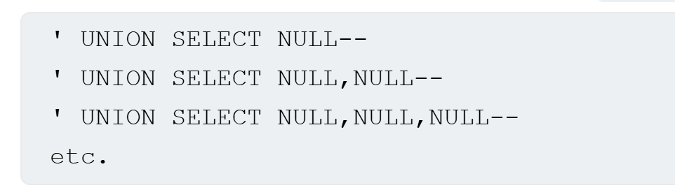

Bypass: ?category='+OR+1=1--

Ở đây khi user chọn 1 categories, application sẽ sử dụng 1 query như:

SELECT * FROM products WHERE category = 'Gifts' AND released = 1

Sau khi dùng dấu ' để đóng lại thì ở đằng sau là  1 mệnh đề luôn đúng thì các sản phẩm ẩn sẽ hiện ra 

-------------------------------------------------------------------------------------------

LAB: SQL injection vulnerability allowing login bypass

Mục tiêu là tấn công để đăng nhập vào tài khoản administrator

Ta đăng nhập bằng tài khoản không hợp lệ để bắt gói tin 


Sau đó gửi đến repeater

Dựa vào request ta đoán rằng khi login, application sẽ kiểm tra tài khoản bằng cách gửi query tới server theo lệnh như: 

SELECT * FROM users WHERE username = 'username' AND password = 'password'

Ta thử bypass bằng cách 

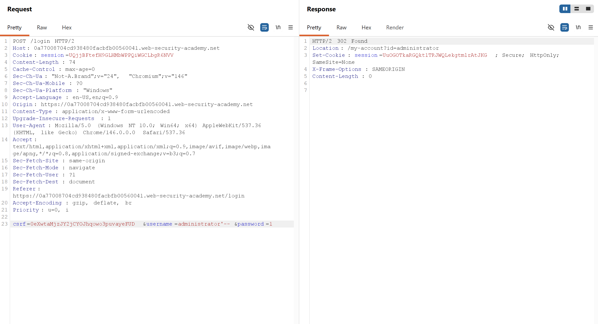

Response trả về 302 Not Found => Bypass thành công 

-------------------------------------------------------------------------------------------

```Union Attack```

Union có thể cho thêm 1 hoặc nhiều SELECT query và gán nó vào kết quả của query ban đầu 

Ví dụ: SELECT a, b FROM table1 UNION SELECT c, d FROM table2

SQL query này sẽ trả về kết quả đơn được cài đặt với 2 cột và bao gồm 4 hàng giá trị a, b của bảng 'table1' và c, d của 'table2' 

Để tiến hành 1 cuộc tấn công SQL Injection UNION Attack cần đảm bảo đạt được 2 yêu cầu 

- Biết được số cột được trả về từ query ban đầu

- Số cột được trả về từ query ban đầu là một loại data phù hợp để giữ kết quả từ việc inject query 

Cách để xác định được số lượng cột 

Cách 1: Dùng UNION NULL


Cách 2: DÙng ORDER BY x 

Nếu server trả về status code = 500 

=> số lượng cột bằng x - 1

Nếu số lượng cột trả về không khớp thì database có thể trả về lỗi như là: 

All queries combined using a UNION, INTERSECT or EXCEPT operator must have an equal number of expressions in their target lists.

-------------------------------------------------------------------------------------------

LAB: SQL injection UNION attack, determining the number of columns returned by the query
PRACTITIONER

Mục tiêu: Xác đinh số lượng cột được trả về 

Ta vào bài lab, click vào một danh mục sau đó dùng burp suite chặn request đó và gửi đến 

repeater 

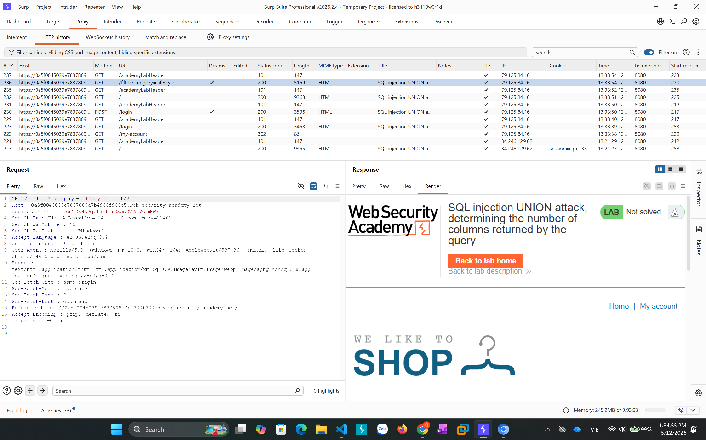

Ta thử chèn thêm câu lệnh select bằng cách sử dụng UNION để ghép 2 câu lệnh select 

Thử thêm NULL đến khi nào server trả về 200 OK 

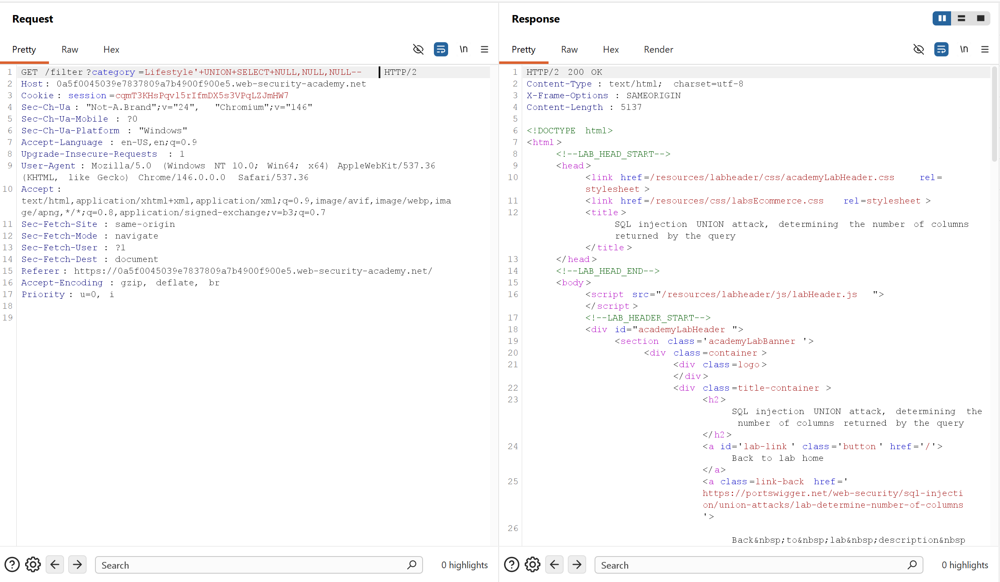

=> Ta đã hoàn thành bài LAB

-------------------------------------------------------------------------------------------

SQL Injection cheat-sheat:

- On Oracle, mỗi SELECT phải sử dụng FROM và chỉ định 1 table có sẵn.

- Có một bảng tích hợp trên Oracle có tên ‘Dual’ có thể được sử dụng cho mục đích này. Vì vậy, các truy vấn được inject trên Oracle sẽ cần trông giống như:

...' UNION SELECT NULL FROM DUAL--

=> Dual table sử dụng để chứa các giá trị NULL.

-------------------------------------------------------------------------------------------

LAB: SQL injection UNION attack, finding a column containing text

Mục tiêu: Xác định cột có chứa dữ liệu 

Ta làm như bài trước nhưng lần này ta xác định số cột bằng cách dùng ORDER BY 

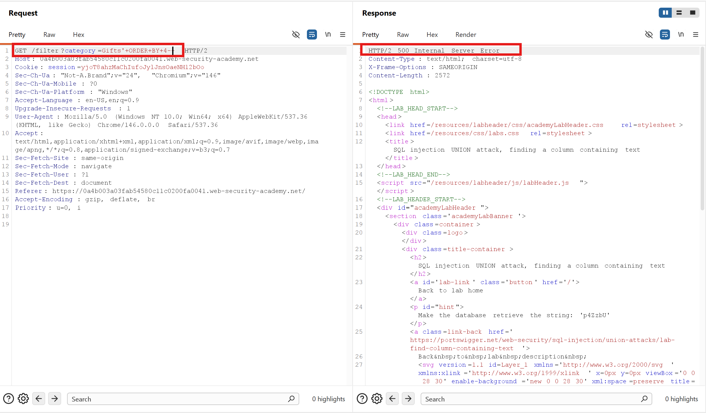

=> Ta xác định được số cột ở bài này là 3 

Giờ ta sẽ dùng UNION SELECT để xác định cột chứa dữ liệu 

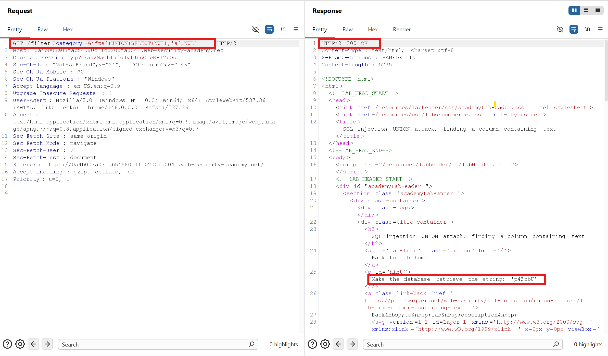

=> Như vậy khi ta thay NULL ở cột thứ 2 thành 'a' thì response trả về 200 OK và xuất hiện chuỗi string 

Giờ ta chỉ cần thay a bằng chuỗi string đó và gửi lại request là hoàn thành bài lab   

-------------------------------------------------------------------------------------------

Khi đã xác định được số cột được trả về bởi truy vấn ban đầu và tìm ra những cột có thể chứa dữ liệu chuỗi, ta có thể truy xuất các dữ liệu cần thiết 

Giả sử rằng:

- Truy vấn ban đầu trả về 2 cột, cả 2 cột đều chứa dữ liệu dạng chuỗi 

- Database chứa 1 bảng có tên là users với các cột là username và password

Trong ví dụ này ta có thể truy xuất nội dung của users bằng cách nhập dữ liệu: 

' UNION SELECT username, password FROM users--

-------------------------------------------------------------------------------------------

LAB: SQL injection UNION attack, retrieving data from other tables

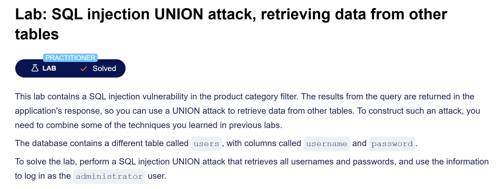

Mục tiêu: Thực hiện injection UNION attack để trích xuất tất cả người dùng và mật khẩu, sau đó đăng nhập vào tài khoản của administrator

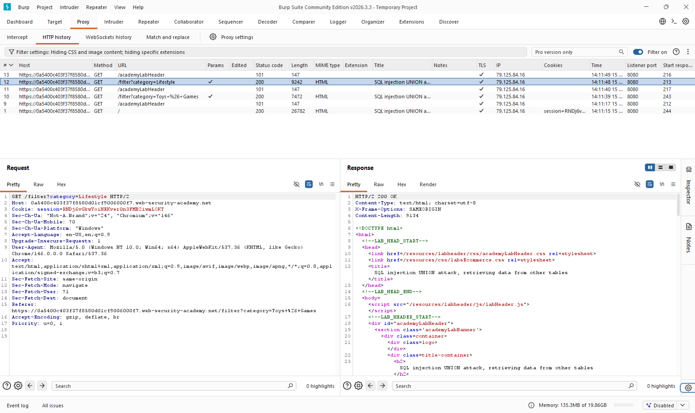

Ta vào bài lab, sau đó chọn 1 danh mục rồi gửi request đó đến repeater 

Theo như đầu bài ta đã biết được bài lab này có 1 bảng tên là users và có 2 cột là username và password 

Ta dùng payload này để inject vào request và gửi đi: '+UNION+SELECT+username,+password+FROM+users--

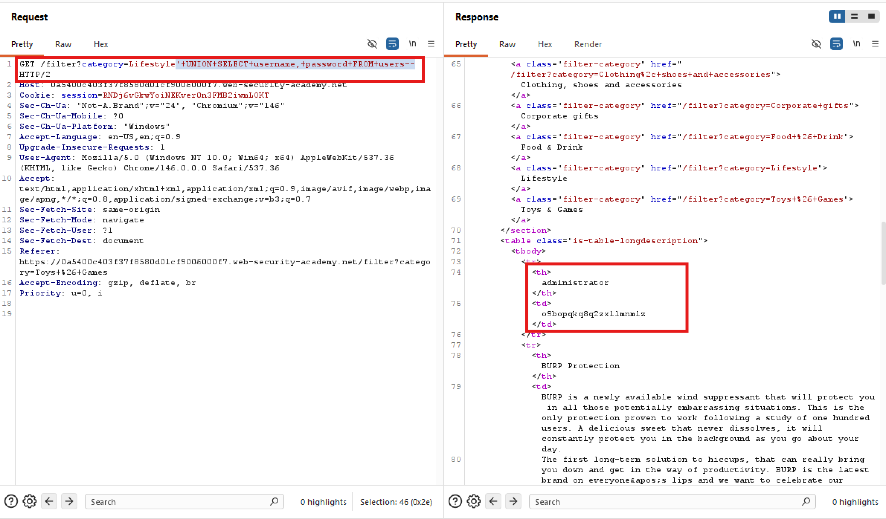

Và ta đã thấy được tài khoản mật khẩu của administrator

-------------------------------------------------------------------------------------------
Trong một số trường hợp, truy vấn chỉ trả về một cột duy nhất, lúc đó ta cần ghép cột lại 

Trên Oracle: ' UNION SELECT username || '~' || password FROM users--

Kết quả trả về có dạng: 

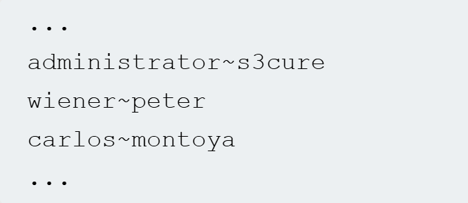

Cách xác định phiên bản của database 

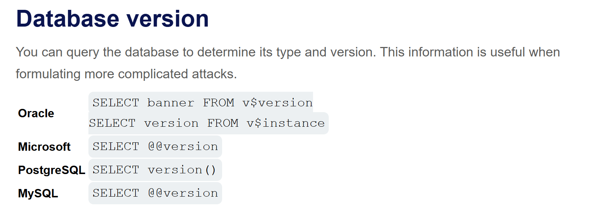

Cách ghép cột của từng version 

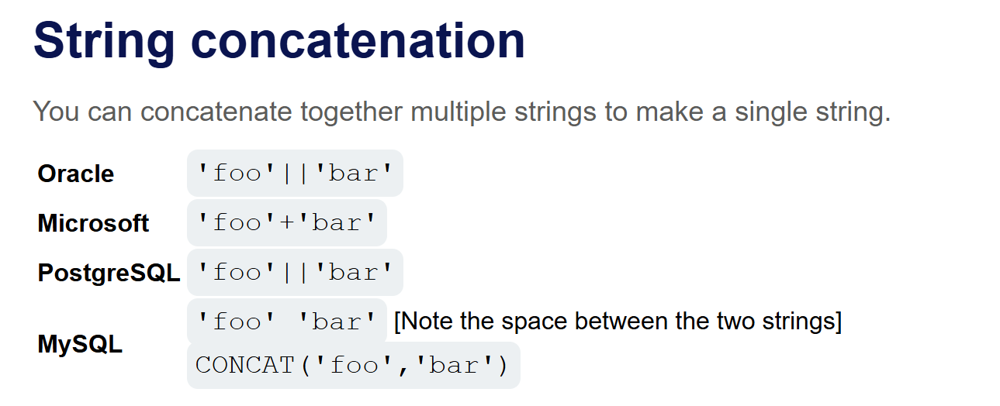

LAB: SQL injection UNION attack, retrieving multiple values in a single column

Mục tiêu: Thực hiện injection UNION attack để trích xuất tất cả người dùng và mật khẩu, sau đó đăng nhập vào tài khoản của administrator

Đầu tiên ta sẽ xác định số cột của bài bằng cách dùng ORDER BY x 

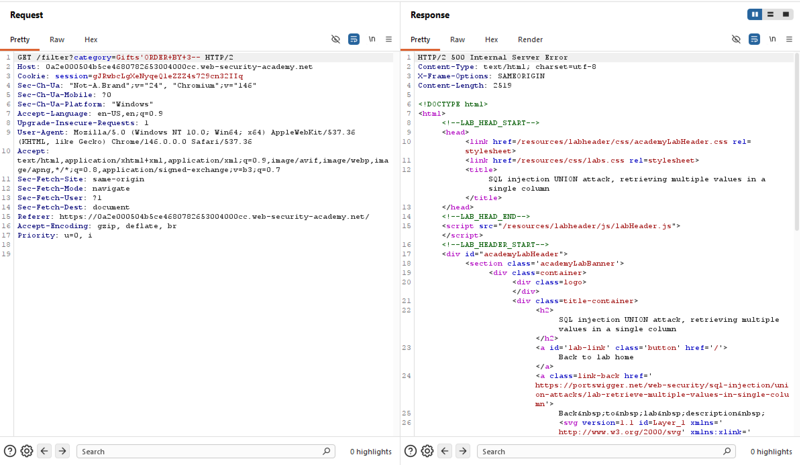

=> Xác định được là có 2 cột

Dựa vào đây ta xác đinh được rằng chỉ cột thứ 2 có giá trị

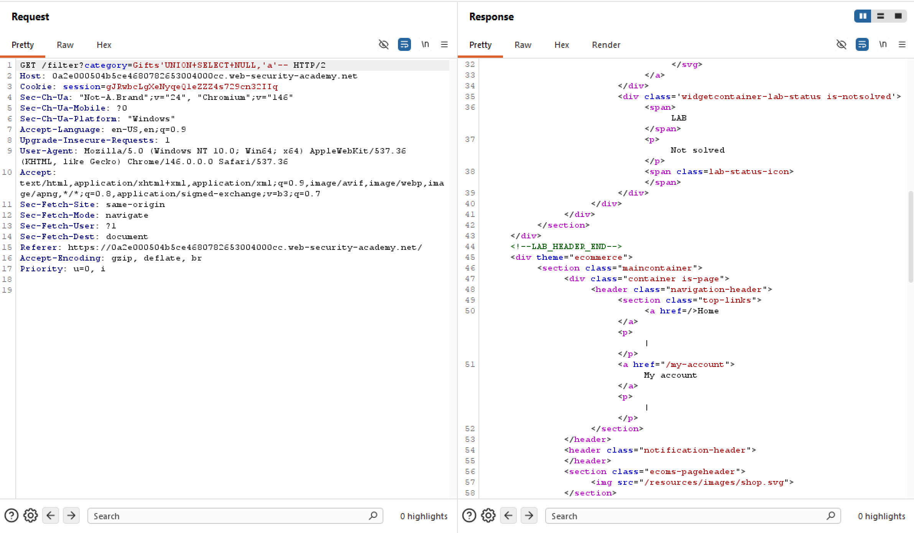

Bây giờ ta cần xác định version của database trong bài này bằng cách thử lần lượt từng payload

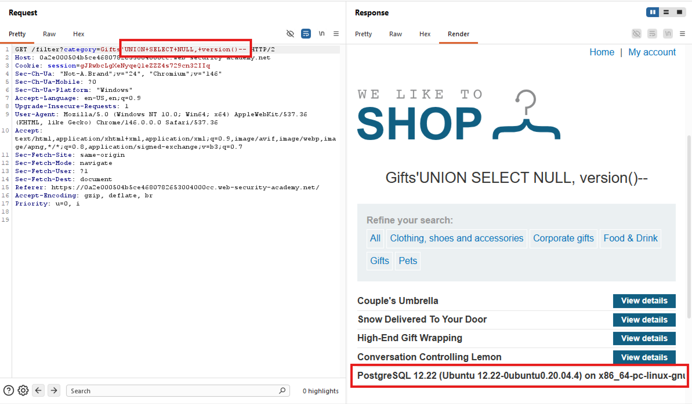

Ta xác định được bài này dùng PostgreSQL 

Sau đó ta dùng payload sau để hoàn thành bài lab: '+UNION+SELECT+NULL,+username+||+'@'+||+password+FROM+users--

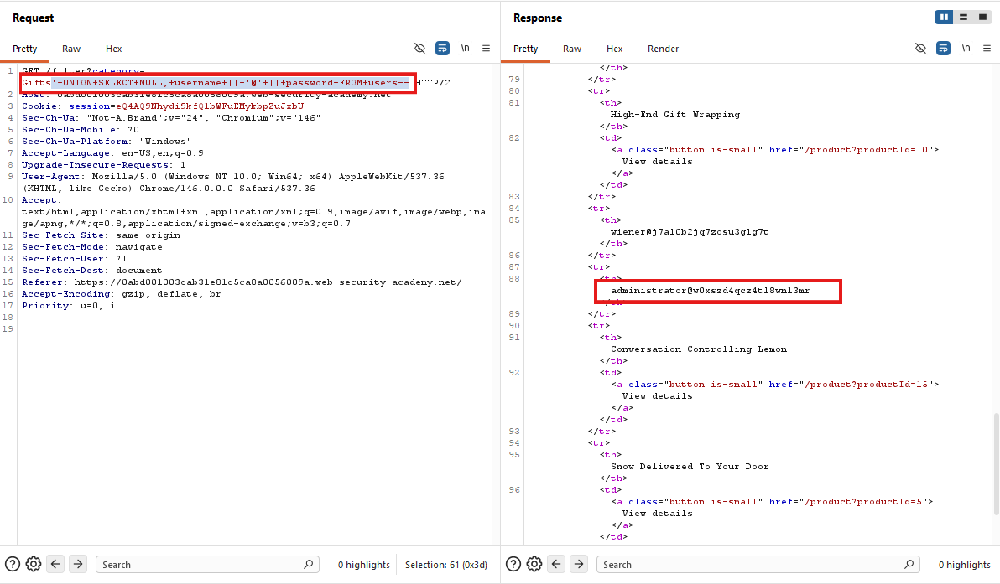

-------------------------------------------------------------------------------------------

Cách kiểm tra phiên bản database 

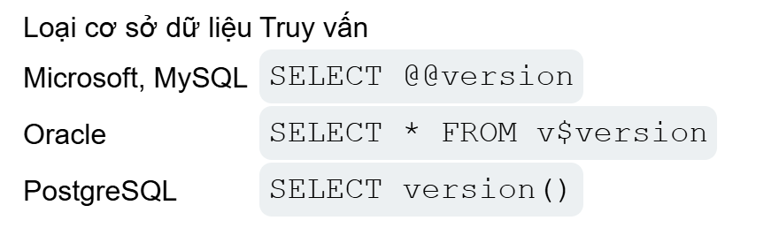

Cách nối 2 string 

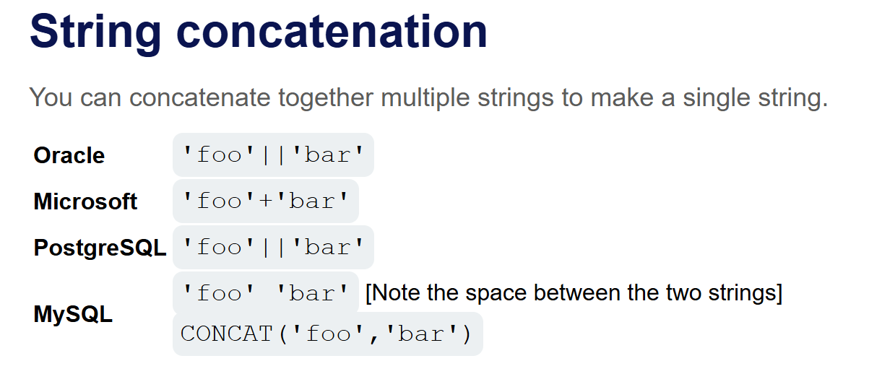

Cách lấy ký tự trong 1 string

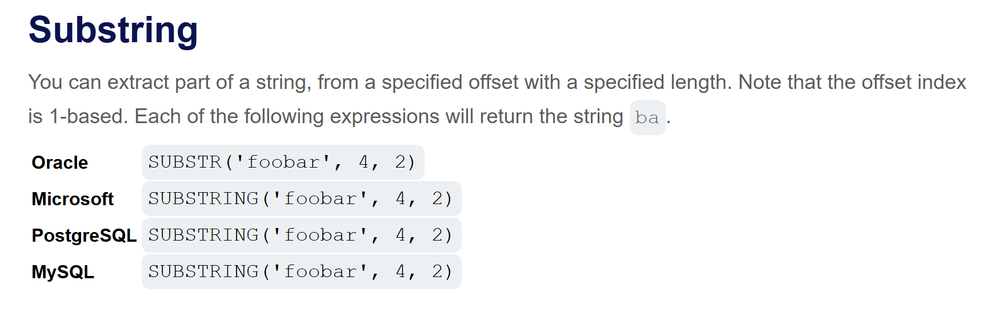

Cách liệt kê các bảng hiện có trong database và các cột mà các bảng đó chứa

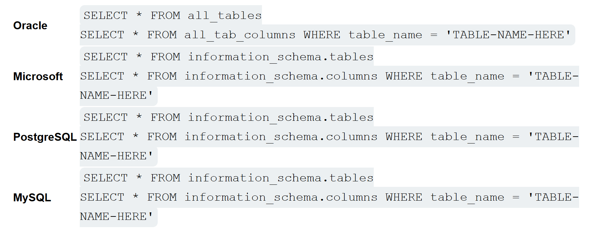

-------------------------------------------------------------------------------------------

LAB: SQL injection attack, listing the database contents on non-Oracle databases

Mục tiêu: Trích xuất dữ liệu để lấy được tài khoản administrator

Đầu tiên ta cần xác định số cột của bài lab này, để từ đó ta xác định database version trong bài này là gì 

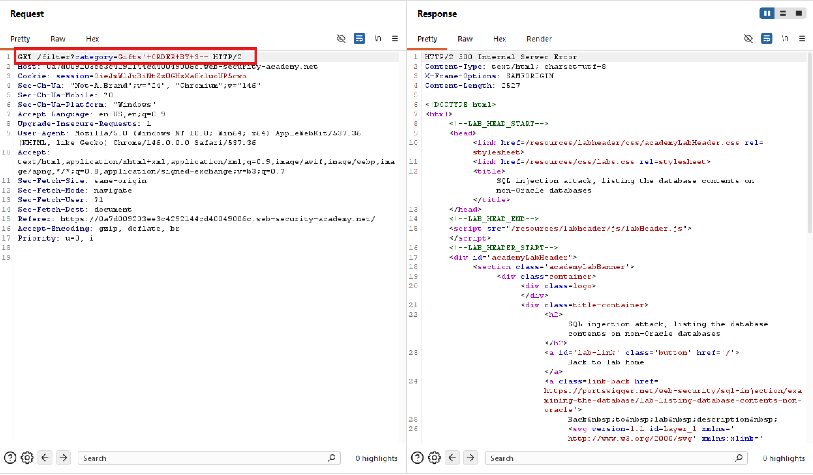

=> Ta xác định được bài này có 2 cột 

Tiếp theo ta cần xác định database version bằng cách thử lần lượt từng payload

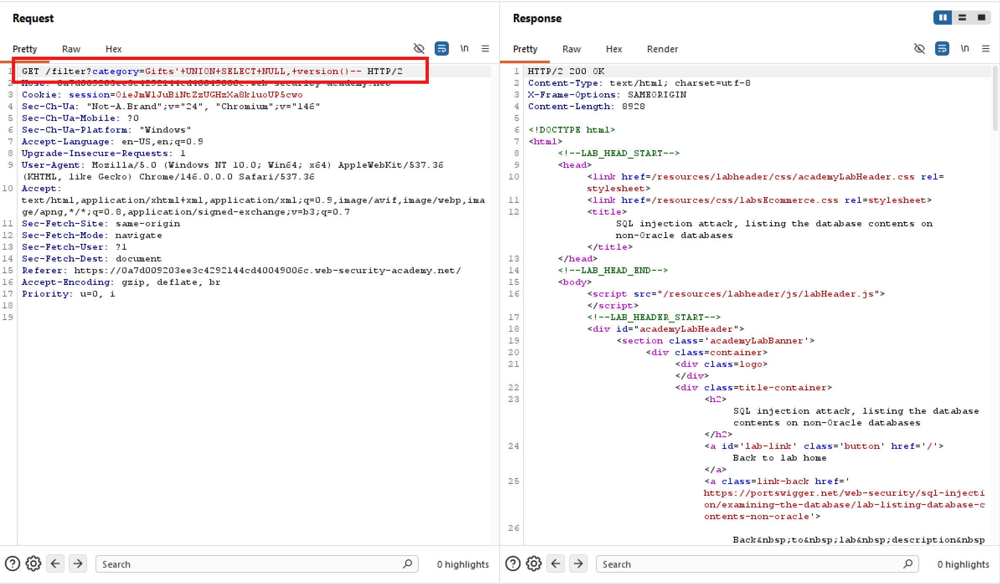

=> Ta xác định được bài này dùng PostgreSQL

Tiếp theo ta sẽ liệt kê các bảng hiện có trong bài lab này bằng cách inject thêm đoạn payload sau: '+UNION+SELECT+table_name,+'a'+FROM+information_schema.tables--

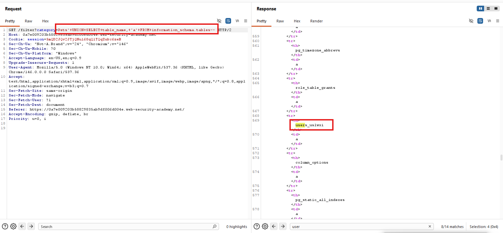

Ta đã thấy tên các bảng và giờ ta cần tìm bảng chứa dữ liệu về tài khoản và mật khẩu, ta thử xem 1 bảng đáng nghi bằng cách chèn payload:

'+UNION+SELECT+column_name,+NULL+FROM+information_schema.columns+WHERE+table_name+=+'users_wcirof'--

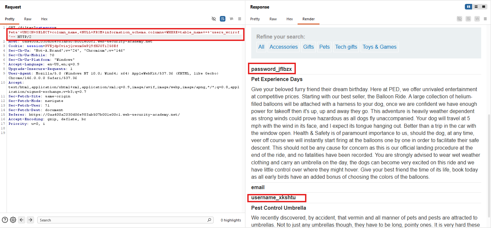

Ta thấy có 2 cột đáng nghi, giờ ta xem data của 2 cột đó xem có gì không bằng cách chèn payload:

'+UNION+SELECT+username_xkshtu,+password_jflbzx+FROM+users_wcirof--

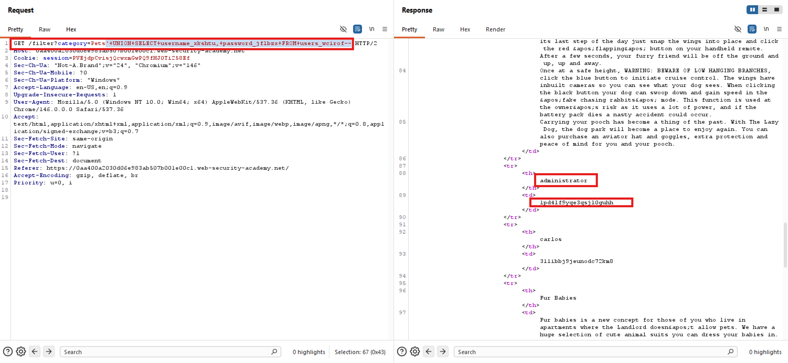

=> Ta đã thấy được tài khoản mật khẩu của administrator

--------------------------------------------------------------------------------------------------

Blind SQL Injection 

Lỗi tấn công SQL injection mù xảy ra khi một ứng dụng dễ bị tấn công SQL Injection, nhưng phản 

hồi HTTP của nó không chứa kết quả của truy vấn SQL liên quan 

Ứng dụng sử dụng cookie TrackingID để theo dõi người dùng. Khi người dùng gửi yêu cầu đến

website, giá trị của cookie sẽ được đưa trực tiếp vào câu truy vấn SQL:

SELECT TrackingId FROM TrackedUsers WHERE TrackingId = 'u5YD3PapBcR4lN3e7Tj4'


